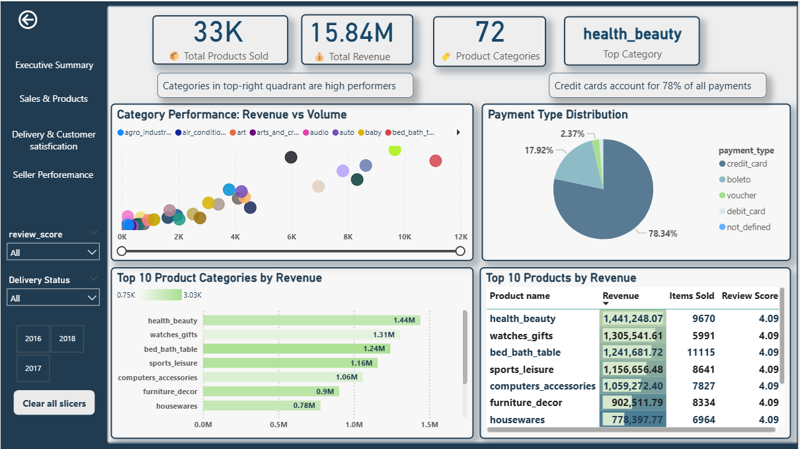
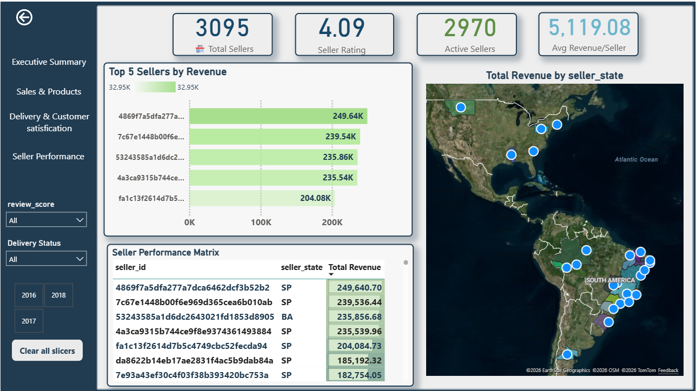

# Olist E-commerce: End-to-End Data Analysis & Power BI Dashboard

## 📌 Project Overview
This project demonstrates a complete **end-to-end data analysis workflow** using the **Olist Brazilian E-commerce dataset**.  
The objective is to transform raw transactional data into **actionable business insights** and an **interactive Power BI dashboard** to support data-driven decision-making.

---

##  Role
Junior Data Analyst

---

## 🛠 Tools & Technologies
- **Excel** – Initial data exploration and data quality checks  
- **SQL** – Data modeling, joins, aggregations, and business analysis  
- **Python (Pandas, Matplotlib, Seaborn)** – Data cleaning and exploratory data analysis  
- **Power BI** – Data modeling, DAX measures, and interactive dashboard

---

## 📁 Project Structure

```text
Olist-Ecommerce-End-to-End-Data-Analysis/
├── README.md
├── data/
│   ├── cleaned
├── sql/
├── notebooks/
├── reports/
└── assets/
```


---

## 🎯 Business Objectives
- Analyze sales and order trends over time  
- Understand customer purchasing behavior  
- Evaluate delivery performance and delays  
- Identify top-performing products and categories  

---

## ❓ Key Business Questions
- How do sales and orders trend over time?
- Which product categories generate the highest revenue?
- What payment methods are most frequently used?
- How long does order delivery take?
- Which customer regions contribute most to revenue?

---

## 🔄 Project Workflow

### 1. Data Understanding & Profiling
- Reviewed multiple relational tables (orders, customers, products, payments, sellers)
- Identified missing values, duplicates, and inconsistent data types

### 2. Data Cleaning & Preparation
- Cleaned and standardized data using Python
- Joined multiple tables into a single analytical dataset
- Handled missing delivery dates and invalid records

### 3. SQL Analysis
- Imported cleaned data into SQL
- Created tables with proper keys
- Wrote queries to analyze revenue, orders, customers, and delivery performance

### 4. Exploratory Data Analysis (EDA)
- Performed descriptive statistics and trend analysis
- Visualized sales, category performance, and delivery times

### 5. Power BI Dashboard
- Built a star-schema data model
- Created DAX measures:
  - Total Revenue
  - Total Orders
  - Average Order Value
  - Average Delivery Time
- Designed an interactive dashboard with filters and drill-downs

### 6. Insights & Reporting
- Summarized key insights
- Provided business recommendations
- Identified data limitations

---

## 📊 Dashboard Screenshots

### Executive Summary


### Sales & Products


### Sellers Perforemance


### Delivery & Customer Satisfication


---

## ✅ Key Skills Demonstrated
- Data Cleaning & Preparation  
- SQL Joins & Aggregations  
- Exploratory Data Analysis  
- Power BI Data Modeling & DAX  
- Business Insight & Storytelling  

---

## 🔗 Dataset Source
Olist Brazilian E-commerce Dataset (Kaggle)

## ⚠️ Notes
Due to GitHub file size limitations, large files such as the full Power BI (.pbix) file and raw datasets are not included in this repository.

The dashboard screenshots and analysis outputs are provided instead to demonstrate the project results.


